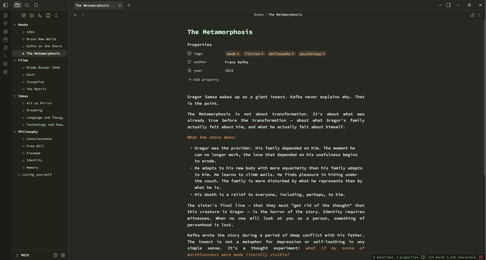

# Paper Source Theme

A standalone Obsidian theme with a light mint typewriter look and distinct organic green/orange accents.

Inspired by paper typewriter aesthetics and Source Code Pro typography.

## Features

- **Source Code Pro** font used everywhere for a clean monospace typewriter feel.
- **Justified text** and underlined tan backlinks in notes.
- **Bold and Italic** text styled in warm orange for highlights.
- Color-coded organic green heading ladder.
- Premium dark mode with dark-green surfaces and mint text.

## Installation

1. Copy this folder into your vault's `.obsidian/themes/` directory.
2. Select **Paper Source** in Settings -> Appearance -> Theme.
